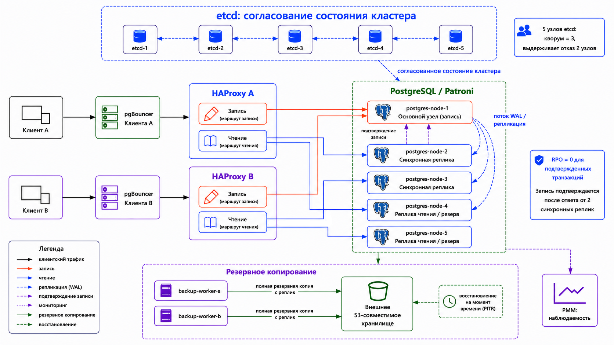

# Построение отказоустойчивого PostgreSQL-кластера для платформы краткосрочной аренды жилья

Проект выполняется в рамках курса OTUS **"Базы данных"**.

Цель проекта - показать базу данных как инженерную систему: от доменной схемы для платформы краткосрочной аренды жилья до кластера PostgreSQL, который сохраняет подтвержденные транзакции, продолжает работу при отказе отдельных узлов и поддерживает восстановление из резервных копий.

## Постановка задачи

Платформа краткосрочной аренды жилья работает с данными, для которых важны согласованность и сохранность:

- пользователь не должен забронировать уже занятое жилье;
- цена бронирования должна соответствовать календарю и правилам ценообразования;
- подтвержденное бронирование и связанный платеж не должны пропадать при отказе сервера;
- ошибочное изменение данных должно быть восстанавливаемым;
- база данных должна оставаться наблюдаемой и управляемой во время отказов.

Поэтому проект рассматривает не только структуру таблиц, но и эксплуатационный контур вокруг PostgreSQL: запуск кластера, автоматическое переключение при отказе, резервное копирование, восстановление и демонстрационные сценарии.

## Требования и архитектурные следствия

Основные решения в проекте выводятся из требований к системе:

| Требование | Архитектурное решение | Обоснование |
| --- | --- | --- |
| База должна переживать отказ отдельного узла | PostgreSQL запускается как кластер из пяти узлов под управлением Patroni | Один узел принимает запись, остальные хранят копии данных и могут стать новым основным узлом |
| Нужен согласованный выбор основного узла | Используется пять узлов etcd | Patroni хранит в etcd состояние кластера; при пяти узлах система согласования переживает отказ двух узлов |
| Подтвержденные записи не должны теряться | Запись подтверждается только после попадания на основной узел и две синхронные реплики | Если основной узел откажет, подтвержденная запись уже есть на других узлах |
| Клиентский доступ не должен зависеть от одного прокси | Для каждого демонстрационного клиента поднимается своя цепочка PgBouncer + HAProxy | Отказ прокси клиента A не ломает доступ клиента B к кластеру |
| Логические ошибки должны быть восстанавливаемыми | Используются полные резервные копии и архив WAL | Репликация повторяет ошибку на все узлы, поэтому для восстановления нужен отдельный механизм |
| Проект должен быть воспроизводимым локально | Все компоненты запускаются через Docker Compose и короткие команды Makefile | Стенд можно поднять на учебной машине без ручной настройки серверов |

Эти решения вместе образуют контур высокой доступности. Контур высокой доступности - часть архитектуры, отвечающая за непрерывную работу базы данных при отказе отдельных узлов. В проекте к этому контуру относятся PostgreSQL/Patroni, etcd, клиентские цепочки PgBouncer + HAProxy и правила синхронного подтверждения записи.

## Предметная область

Доменная модель описывает основные сущности платформы краткосрочной аренды жилья:

- пользователи, роли и права доступа;
- объявления о жилье и фотографии;
- адреса, города, страны и валюты;
- календарь доступности жилья;
- базовые цены и история изменения цен;
- бронирования, платежи и отзывы.

Эти сущности выбраны не только как учебный пример схемы базы данных. Они дают практические сценарии для проверки ограничений целостности: занятость дат, связь бронирования с платежом, расчет стоимости проживания, статусы бронирований и отзывы только после завершения проживания.

Подробная модель предметной области описана в `docs/01_domain_model.md`, а отдельный список бизнес-инвариантов - в `docs/10_domain_invariants.md`.

## Контур высокой доступности

Общая схема стенда:



Patroni управляет ролями PostgreSQL-узлов: отслеживает доступность основного узла и реплик, а при отказе инициирует переключение. etcd используется как согласованное хранилище состояния кластера: в нем фиксируется, какой узел имеет право принимать запись, какие узлы доступны и можно ли безопасно выбрать новый основной узел.

Клиентский доступ показан двумя независимыми цепочками: `PgBouncer клиента A -> HAProxy клиента A` и `PgBouncer клиента B -> HAProxy клиента B`. PgBouncer держит пул соединений ближе к клиенту, а HAProxy выбирает, куда отправить запрос: на текущий основной узел для записи или на реплики для чтения. За счет двух HAProxy отказ маршрутизатора одного клиента не становится общей точкой отказа для второго клиента.

Мигратор на схеме не выделен как отдельный клиентский путь: он использует служебный маршрут записи через `haproxy-client-a`. Этот порядок описан ниже в разделе про миграции.

Для пяти узлов etcd кворум равен трем. Это означает, что система согласования продолжает работу, пока доступны любые три узла из пяти. Такой состав выбран для демонстрации более устойчивой топологии, чем минимальный вариант из трех узлов.

PostgreSQL работает в строгом синхронном режиме. Клиентская запись считается успешной только после того, как она записана на основной узел и еще минимум на две синхронные реплики. Если двух синхронных реплик нет, запись останавливается. Это снижает доступность записи в аварийной ситуации, но сохраняет ключевую гарантию: подтвержденные данные не теряются.

## Гарантии данных

`RPO` показывает, сколько уже подтвержденных данных система может потерять при аварии.

Целевая гарантия проекта - `RPO = 0` для подтвержденных транзакций. Это означает: если клиент получил успешный ответ на запись, эта запись не должна пропасть при отказе основного узла, пока в момент записи были доступны две синхронные реплики.

Граничный сценарий:

- работает основной узел и две синхронные реплики - запись доступна;
- если одна из текущих синхронных реплик отказала, но Patroni может выбрать другую подходящую реплику, запись после перестройки синхронного набора остается доступной;
- если после отказов не остается двух подходящих синхронных реплик - запись останавливается;
- остановка записи в этом случае является защитным поведением;
- чтение и диагностика могут продолжать работать, но новые изменения данных не принимаются с ослабленной гарантией.

`RTO` показывает, сколько времени занимает восстановление работы после аварии.

В проекте отдельно рассматриваются:

- время автоматического переключения на новый основной узел;
- время восстановления из полной резервной копии;
- время восстановления на нужный момент времени через PITR.

`PITR` - восстановление на конкретный момент времени. Этот механизм нужен для защиты от логических ошибок: ошибочного `DELETE`, `UPDATE`, `DROP` или неудачной миграции. Репликация не решает такую проблему, потому что корректно повторяет ошибочное изменение на все реплики. Для восстановления нужна полная резервная копия и архив WAL, чтобы поднять отдельный восстановительный узел на момент до ошибки.

## Миграции

Схема базы данных создается последовательной цепочкой миграций без tablespaces:

```text
db/migrations/V001__database_baseline.sql
db/migrations/V002__reference_catalogs.sql
db/migrations/V003__users_listings_photos.sql
db/migrations/V004__pricing_availability.sql
db/migrations/V005__bookings_payments_reviews.sql
db/migrations/V006__indexes_comments_grants.sql
```

Обратные миграции находятся в `db/rollback/`.

Миграции применяются после запуска кластера и слоя маршрутизации:

```text
контейнер мигратора -> маршрут записи haproxy-client-a -> текущий основной узел PostgreSQL
```

Такой порядок выбран по инженерной причине: сначала появляется рабочий кластер и стабильная точка подключения для записи, затем меняется схема базы данных. Мигратор подключается через `haproxy-client-a` напрямую к основному узлу и не использует PgBouncer. Для DDL-команд это проще и надежнее, потому что миграции требуют предсказуемой сессии и не должны зависеть от режима пула соединений.

Tablespaces в проекте не используются. Для демонстрации отказоустойчивого кластера важнее показать репликацию, переключение основного узла и восстановление. Размещение объектов базы данных по физическим дискам относится к другому уровню проектирования и в локальном Docker-стенде усложняет чтение без существенной пользы для темы.

## Клиентское чтение

В проекте выделяются два режима чтения.

Обычный режим:

```text
запись -> точка записи -> основной узел
чтение -> точка чтения -> реплики
```

Он разгружает основной узел и подходит для экранов, где допустима небольшая задержка репликации: например, каталог объявлений или аналитические выборки.

Строгий режим:

```text
запись -> точка записи -> основной узел
чтение -> точка записи -> основной узел
```

Он используется там, где клиент должен сразу прочитать собственную запись. Например: пользователь создал бронирование и сразу открывает страницу подтверждения. В этом случае чтение с реплики может быть нежелательным, потому что реплика теоретически может немного отставать.

## Резервное копирование и восстановление

Резервное копирование дополняет репликацию. Репликация защищает от отказа узла, но не защищает от логической ошибки. Поэтому в проекте отдельно рассматриваются полные резервные копии, архив WAL и восстановление на нужный момент времени.

В базовом `.env.example` архивирование WAL выключено:

```text
ENABLE_WAL_ARCHIVE=false
```

Так стенд можно запустить без реального S3-хранилища. Для сценариев резервного копирования и PITR нужно указать рабочее S3-совместимое хранилище, подготовить раздел pgBackRest для проекта и включить:

```text
ENABLE_WAL_ARCHIVE=true
```

Резервное копирование не запускается на каждой реплике. Вместо этого используется отдельный контур:

```text
backup-worker-a
backup-worker-b
  -> выбор подходящей реплики
  -> запуск полной резервной копии через pgBackRest
  -> проверка состояния резервной копии
  -> тест восстановления
```

Такой подход разделяет хранение данных, обслуживание кластера и процесс резервного копирования. Этот процесс не зависит от одной машины или одного контейнера, а сами резервные данные хранятся во внешнем надежном S3-совместимом хранилище. Локальный Docker-стенд демонстрирует архитектуру и порядок действий, но не подменяет промышленное S3-хранилище.

## Команды

Публичный интерфейс намеренно короткий:

```text
make up
make clear
make verify
make demo SCENARIO=<name>
make down
```

`Makefile` выбирает готовый исполняемый файл из `bin/` и запускает его. Для обычного запуска проекта Go на машине не нужен.

Готовые исполняемые файлы:

```text
bin/rentalctl.exe
bin/rentalctl-linux-amd64
bin/rentalctl-darwin-amd64
bin/rentalctl-darwin-arm64
```

Исходный код консольного инструмента лежит в `cmd/rentalctl/` и `internal/`. Он нужен для разработки инструмента, но не для запуска демонстрационного стенда.

Назначение команд:

- `make up` - поднять демонстрационный стенд;
- `make clear` - очистить прикладные и демонстрационные данные без удаления контейнеров и томов Docker;
- `make verify` - проверить состояние контейнеров и доступность точки записи;
- `make demo SCENARIO=<name>` - запустить выбранный демонстрационный сценарий;
- `make down` - удалить стенд, тома Docker и временное состояние.

Демонстрационные сценарии:

```text
SCENARIO=domain
SCENARIO=migration
SCENARIO=failover
SCENARIO=proxy
SCENARIO=rpo-zero
SCENARIO=backup
SCENARIO=pitr
SCENARIO=observability
```

## Требования к стенду

Минимально:

```text
CPU: 6 ядер
RAM: 24 GB
Disk: 50 GB свободного места
Docker: обязателен
OS:
  - Windows 10/11 + Docker Desktop + WSL2
  - Linux x86_64 + Docker Engine + Docker Compose v2
  - macOS 13+ + Docker Desktop
```

Рекомендуемо:

```text
CPU: 6-8 ядер
RAM: 32 GB
Disk: 80+ GB свободного места
Docker: обязателен
```

Для Windows предпочтителен WSL2. Для macOS нужно заранее выделить Docker Desktop достаточно CPU и памяти. Для Linux достаточно Docker Engine и плагина Docker Compose v2.

## Документация

- `docs/00_project_brief.md` - цель и границы проекта.
- `docs/01_domain_model.md` - доменная модель.
- `docs/02_schema_design.md` - схема базы данных, миграции и инварианты.
- `docs/03_cluster_topology.md` - устройство кластера: Patroni, etcd, PgBouncer, HAProxy и PMM.
- `docs/04_rpo_rto.md` - RPO, RTO и границы гарантий.
- `docs/05_backup_pitr.md` - резервное копирование, pgBackRest, архив WAL и PITR.
- `docs/06_runbooks.md` - инструкции для действий при отказах.
- `docs/07_demo_plan.md` - план демонстрации на защите.
- `docs/08_production_requirements.md` - требования к реальной production-системе.
- `docs/09_sources.md` - источники и документация инструментов.
- `docs/10_domain_invariants.md` - доменные инварианты и границы ответственности базы данных.
- `docs/adr/` - архитектурные решения и их обоснование.

## Визуальные материалы

Схемы топологий хранятся в `docs/diagrams/png/`. Подтверждения демонстрационных сценариев создаются вручную после выполнения сценариев и сохраняются рядом со сценариями в `demo/*/artifacts/`.
