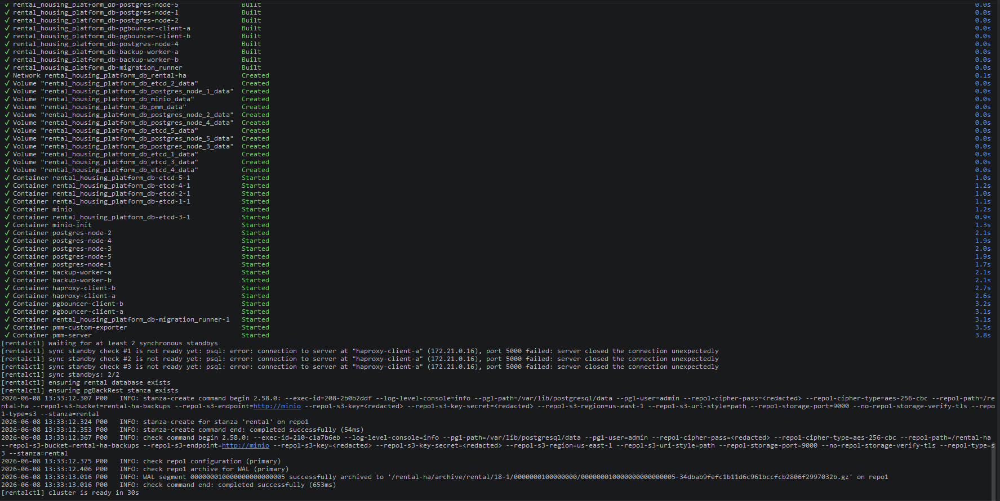

# 01-cluster

## Что фиксирует раздел

Раздел фиксирует успешное поднятие демонстрационного HA-стенда: запуск контейнеров, ожидание двух синхронных реплик, подготовку прикладной базы данных и проверку раздела pgBackRest.

## Получившиеся артефакты

### cluster-up.png

Показывает итог выполнения `make up`: кластер дождался двух синхронных standby, прикладная база данных подготовлена, stanza pgBackRest создана и проверена, а стенд перешел в состояние готовности.
