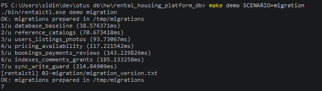

# 02-migration

## Что фиксирует раздел

Раздел фиксирует применение схемы базы данных последовательной цепочкой миграций. Миграции выполняются после запуска кластера через служебный маршрут записи, поэтому DDL-команды попадают на текущий основной PostgreSQL-узел.

## Получившиеся артефакты

### migration-result.png

Фиксирует применение цепочки DDL-миграций через `make demo SCENARIO=migration` и версию последней миграции. Значение версии `7` соответствует полному набору файлов `V001`-`V007`, включая guard для проверки двух синхронных standby перед прикладными DML-записями.
