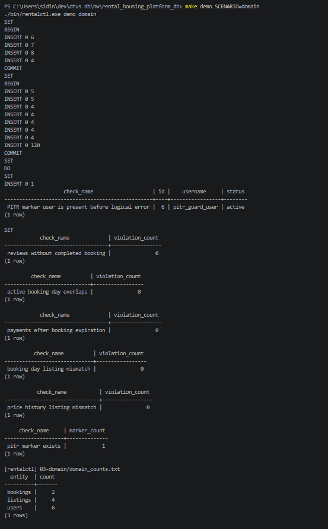

# 03-domain

## Что фиксирует раздел

Раздел фиксирует проверку предметной области и доменных ограничений базы данных. В ходе проверки применяются справочники, демонстрационные пользователи, объявления, бронирования и SQL-тесты бизнес-инвариантов.

## Получившиеся артефакты

### domain-result.png

Фиксирует успешное выполнение `make demo SCENARIO=domain`: загрузку seed-данных, контрольные количества пользователей, объявлений и бронирований, а также SQL-проверки из `db/tests/001_domain_invariants.sql`.
