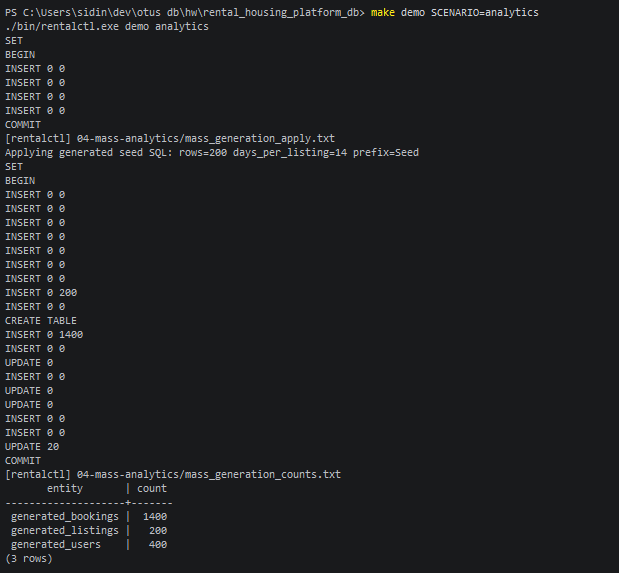
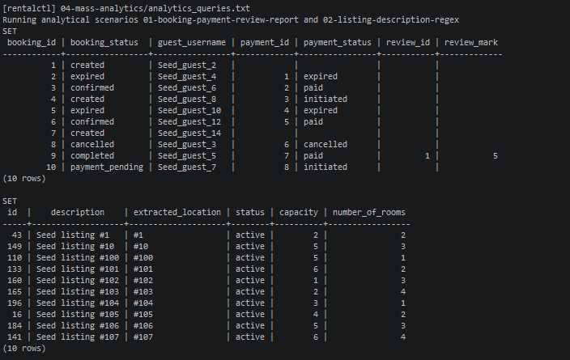

# 04-mass-analytics

## Что фиксирует раздел

Раздел фиксирует переход от небольших доменных seed-данных к нагрузочному демонстрационному набору. После массовой генерации выполняются аналитические SQL-сценарии из `scenarios/analytical`, чтобы показать, что схема пригодна не только для инвариантов и точечных DML-операций, но и для отчетных чтений.

## Получившиеся артефакты

### mass-generation-result.png

Показывает применение данных, созданных `rentalctl seedgen`: дополнительные пользователи, объявления, доступность, бронирования, платежи, отзывы и контрольные количества после загрузки.

### analytics-queries-result.png

Показывает выполнение двух аналитических запросов из `scenarios/analytical`: отчета по бронированиям, платежам и отзывам, а также поиска объявлений по формату описания с извлечением признака регулярным выражением.
