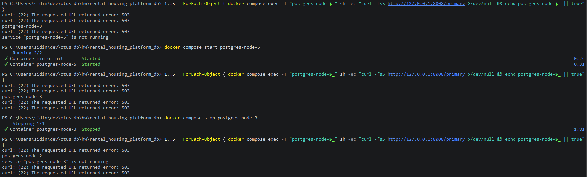

# 05-failover

## Что фиксирует раздел

Раздел фиксирует проверку автоматического переключения при отказе текущего основного PostgreSQL-узла. Сценарий подтверждает, что Patroni выбирает новый основной узел через согласованное состояние etcd без ручного назначения лидера.

## Получившиеся артефакты

### failover-primary-switch.png

Показывает основной результат сценария: до отказа primary был `postgres-node-3`, после остановки этого контейнера Patroni автоматически выбрал новым primary `postgres-node-2`.
