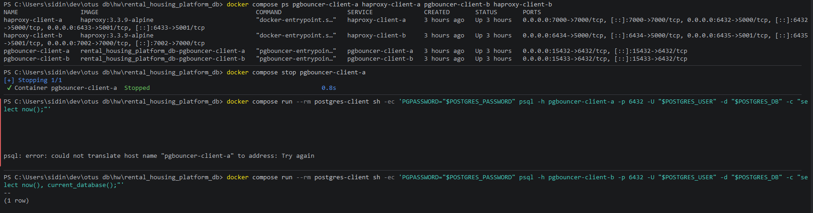

# 06-proxy-failure

## Что фиксирует раздел

Раздел фиксирует проверку независимости клиентских цепочек подключения. В проекте клиент A и клиент B имеют собственные пары PgBouncer + HAProxy, поэтому отказ одной цепочки не должен становиться общей точкой отказа.

## Получившиеся артефакты

### proxy-failure-result.png

Фиксирует остановку `pgbouncer-client-a` или `haproxy-client-a`, ошибку клиента A и успешный SQL-запрос клиента B через независимую цепочку.
