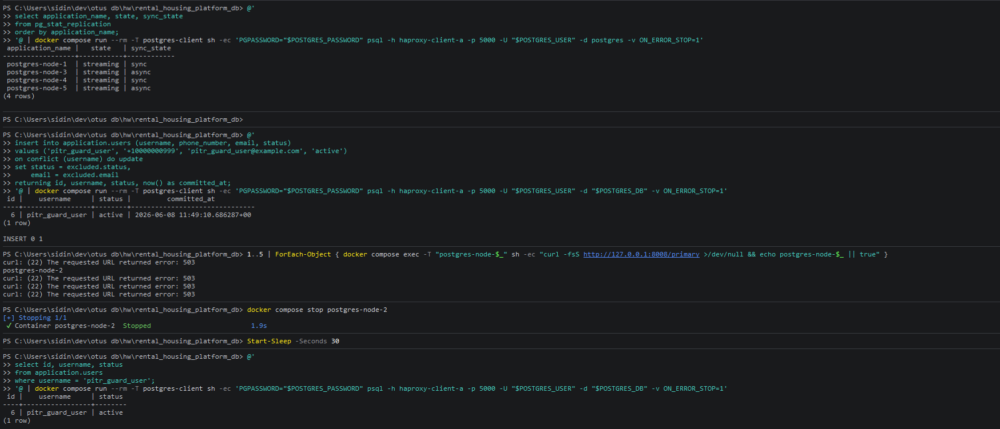
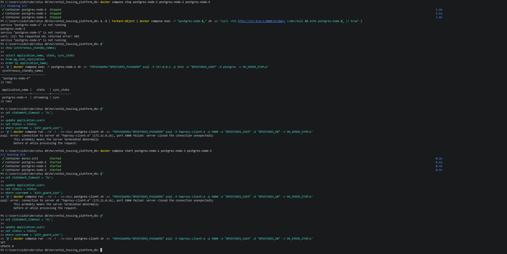

# 07-sync-rpo-zero

## Что фиксирует раздел

Раздел фиксирует проверку строгой синхронной записи. Целевая гарантия проекта состоит в том, что подтвержденная транзакция не теряется при отказе основного узла, если в момент записи были доступны минимум две синхронные реплики.

## Получившиеся артефакты

### rpo-preserved-transaction.png

Показывает наличие двух синхронных реплик, подтвержденную контрольную запись до отказа primary и чтение той же записи после failover.

### rpo-write-blocked.png

Показывает защитное поведение системы: новая запись не подтверждается, если после деградации осталось меньше двух доступных синхронных standby.
