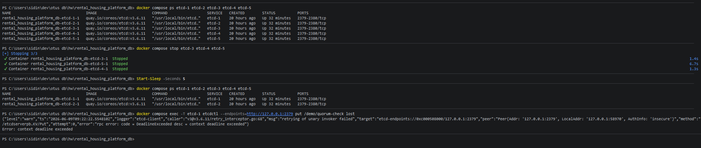
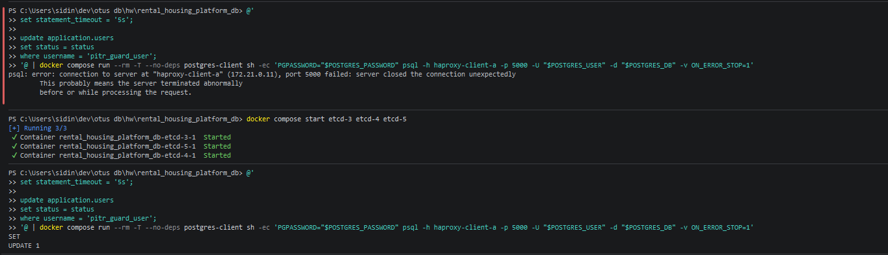

# 08-etcd-quorum

## Что фиксирует раздел

Раздел фиксирует правило большинства для пятиузлового etcd-кластера. Для состава 5 узлов кворум равен 3, поэтому после потери трех etcd-узлов Patroni не должен безопасно продолжать DCS-операции, а штатная новая запись через write-route должна прекратиться после реакции Patroni на потерю DCS-кворума и до восстановления большинства.

## Получившиеся артефакты

### etcd-quorum-lost.png

Показывает остановку трех etcd-узлов и состояние, при котором в исходном составе 5 остается только 2 доступных участника. Эти два узла физически могут быть запущены, но не образуют большинство и не могут подтверждать согласованные решения.

### etcd-write-stopped.png

Показывает прикладную проверку после потери кворума и паузы на `ttl`/`loop_wait` Patroni: новая запись через штатный маршрут `haproxy-client-a:5000` не подтверждается, а после возврата etcd-узлов и восстановления кворума write-route снова становится доступен.
