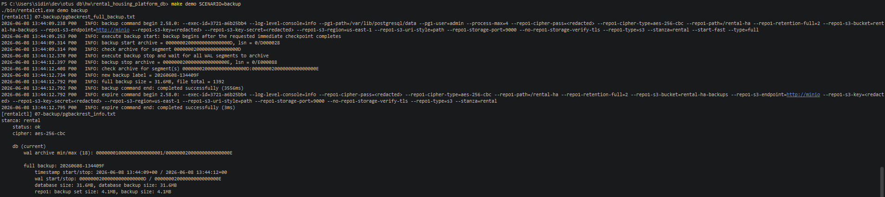
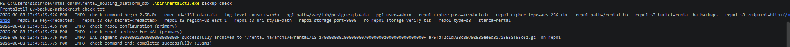

# 09-backup

## Что фиксирует раздел

Раздел фиксирует проверку резервного копирования через pgBackRest. Резервное копирование рассматривается отдельно от репликации, потому что репликация не защищает от логических ошибок и некорректных миграций.

## Получившиеся артефакты

### pgbackrest-backup-info.png

Фиксирует запуск полной резервной копии через pgBackRest и состояние раздела с доступными backup-наборами и WAL.

### pgbackrest-check.png

Подтверждает, что репозиторий резервных копий доступен и пригоден для восстановления.
