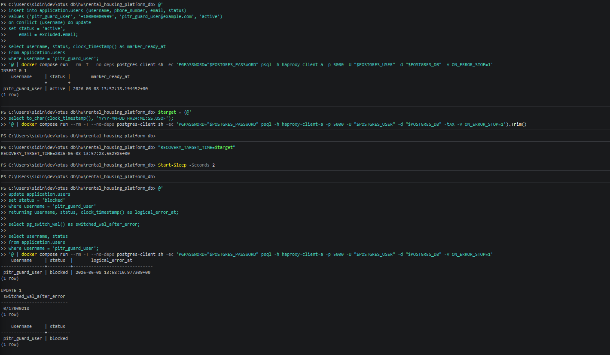
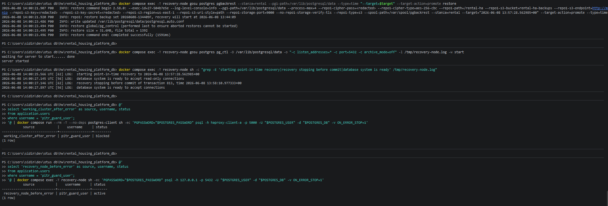

# 10-pitr

## Что фиксирует раздел

Раздел фиксирует проверку восстановления на выбранный момент времени. Сценарий моделирует логическую ошибку и восстановление отдельного узла на состояние до этой ошибки.

## Получившиеся артефакты

### pitr-error-point.png

Фиксирует целевую точку восстановления и ошибочный SQL-запрос, который намеренно повреждает рабочие данные.

### pitr-restore-result.png

Фиксирует восстановление отдельного `recovery-node` через pgBackRest и проверочный `SELECT`, подтверждающий состояние до логической ошибки.
