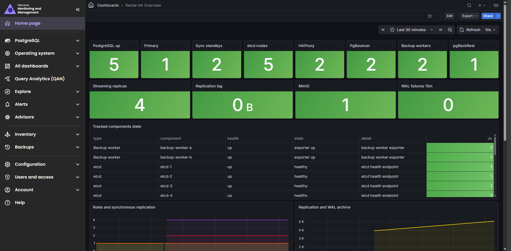
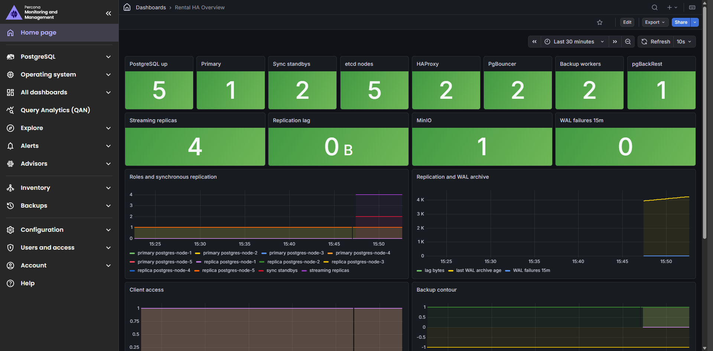
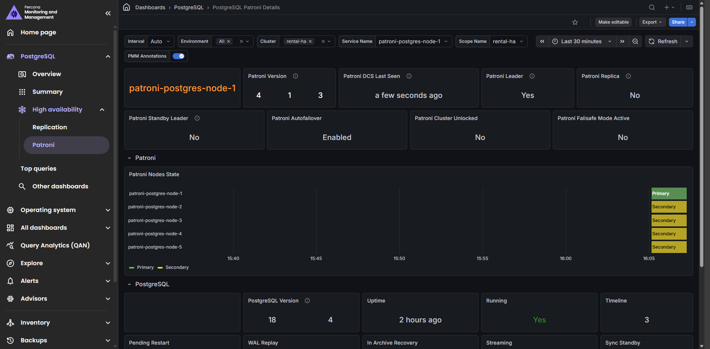

# 11-observability

## Что фиксирует раздел

Раздел фиксирует проверку наблюдаемости кластера. Основной инструмент наблюдения - Percona Monitoring and Management с дашбордом `Rental HA Overview`, дополненный custom exporter-ом проекта.

## Получившиеся артефакты

### rental-ha-overview.png

Показывает агрегированное состояние PostgreSQL, etcd, клиентских цепочек, MinIO и pgBackRest.

### rental-ha-overview-with-table.png

Фиксирует таблицу состояния всех отслеживаемых компонентов.

### rental-ha-overview-bottom.png

Показывает дополнительные метрики резервного контура и активности PostgreSQL.

### patroni-details.png

Показывает специализированный дашборд Patroni для выбранного сервиса.
