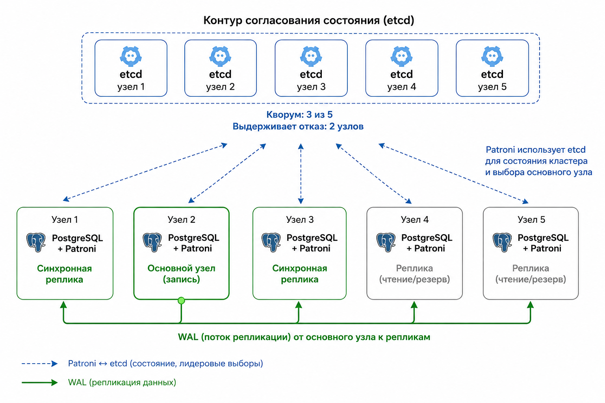
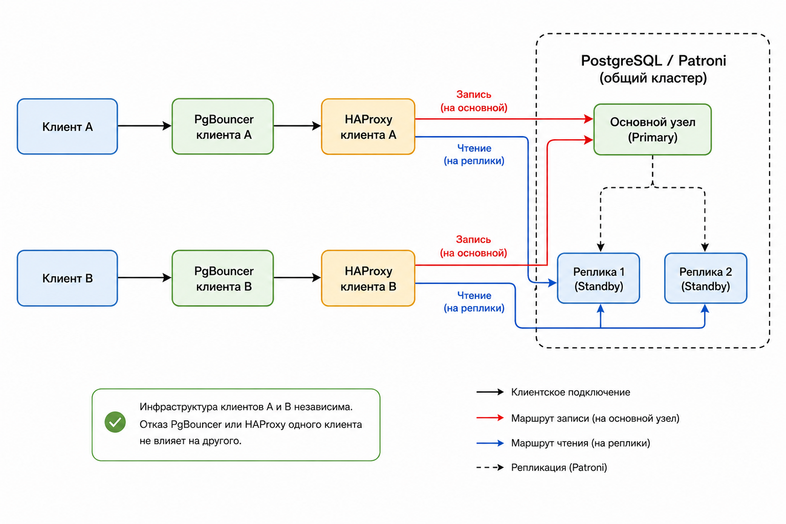
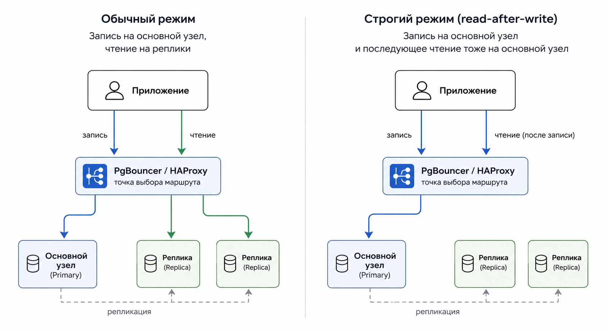
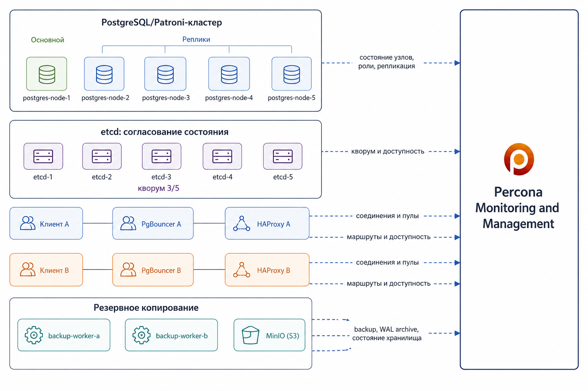

# Топология кластера

## Назначение

Топология описывает эксплуатационный контур вокруг PostgreSQL: узлы базы данных, механизм согласования состояния, клиентскую маршрутизацию, резервное копирование и наблюдаемость. Доменная схема, миграции и процедуры восстановления описаны в отдельных документах.

## PostgreSQL и Patroni

Основу кластера составляют пять PostgreSQL-узлов. На каждом узле вместе с PostgreSQL работает Patroni:

```text
postgres-node-1: PostgreSQL + Patroni
postgres-node-2: PostgreSQL + Patroni
postgres-node-3: PostgreSQL + Patroni
postgres-node-4: PostgreSQL + Patroni
postgres-node-5: PostgreSQL + Patroni
```



PostgreSQL хранит прикладные данные платформы аренды жилья. Patroni управляет ролью узла: поддерживает один основной узел для записи, отслеживает реплики, публикует состояние через REST API и выполняет переключение при отказе основного узла.

Право узла принимать запись определяется не локальной доступностью процесса PostgreSQL, а согласованным состоянием Patroni. Это важно для предотвращения ситуации, в которой несколько узлов одновременно считают себя основными.

## Согласование состояния

Согласованное состояние кластера хранится в etcd:

```text
etcd-1
etcd-2
etcd-3
etcd-4
etcd-5
```

Patroni использует etcd для фиксации текущего основного узла, состояния реплик и возможности безопасного переключения. Для пяти узлов etcd кворум равен трем. Кворум вычисляется как большинство от исходного состава:

```text
quorum = floor(N / 2) + 1
```

При пяти узлах система согласования сохраняет работоспособность при отказе двух узлов. Если доступно только два узла из пяти, новые решения не подтверждаются: такая группа не может отличить полный отказ остальных узлов от сетевого раздела. Ограничение защищает кластер от split-brain и не позволяет двум частям системы независимо назначить разные основные узлы.

## Подтверждение записи

Кластер настроен на строгую синхронную запись:

```yaml
synchronous_mode: true
synchronous_mode_strict: true
synchronous_node_count: 2
postgresql:
  parameters:
    synchronous_commit: "on"
```

Запись считается успешной, когда она зафиксирована на основном узле и подтверждена минимум двумя синхронными репликами. Если доступных синхронных реплик становится меньше двух, новые записи останавливаются. Это снижает доступность записи при деградации, но сохраняет целевую гарантию для уже подтвержденных транзакций.

Требование о двух синхронных репликах проверяется явно. Patroni продолжает управлять ролями и синхронным набором, но маршрут записи HAProxy использует отдельную readiness-проверку `ready-write`: узел считается пригодным для записи только если он является primary и видит минимум две реплики со статусом `sync` в `pg_stat_replication`. Дополнительно миграция `V007__sync_write_guard.sql` добавляет DML-guard в прикладной схеме `application`, чтобы прямые прикладные записи также отказывались выполняться при деградации ниже двух sync standby.

## Клиентская маршрутизация

Клиентский доступ разделен на независимые цепочки подключения:

```text
client-a -> PgBouncer A -> HAProxy A -> PostgreSQL/Patroni
client-b -> PgBouncer B -> HAProxy B -> PostgreSQL/Patroni
```



PgBouncer держит пул соединений ближе к клиенту. HAProxy выбирает актуальный маршрут к кластеру по HTTP-проверкам:

- `ready-write` - маршрут записи на текущий primary только при наличии минимум двух синхронных standby;
- `/replica` - маршрут чтения на доступные реплики.

Разделение клиентских цепочек уменьшает область влияния отказа прокси: сбой PgBouncer или HAProxy в одной цепочке не должен блокировать остальные цепочки. После переключения основного узла старые server connections в PgBouncer могут оставаться привязанными к прежнему узлу, поэтому клиентские пулы должны поддерживать переоткрытие соединений через timeout, lifetime или явный `RECONNECT`.

## Режимы чтения

В топологии выделены два режима чтения:

```text
обычная сессия:
  запись -> маршрут записи
  чтение -> маршрут чтения

строгая сессия:
  запись -> маршрут записи
  чтение -> маршрут записи
```



Обычная сессия использует реплики для чтения и снижает нагрузку на основной узел. Строгая сессия читает через маршрут записи и обеспечивает простую гарантию чтения собственных изменений после записи.

## Контур резервного копирования

Резервное копирование вынесено в отдельный контур. PostgreSQL-узлы архивируют журнал предзаписи PostgreSQL (WAL) через pgBackRest, а рабочие контейнеры резервного копирования выполняют полные копии и проверки репозитория:

```text
PostgreSQL/pgBackRest -> MinIO bucket rental-ha-backups
backup-worker-a      -> MinIO bucket rental-ha-backups
backup-worker-b      -> MinIO bucket rental-ha-backups
```

В локальной топологии роль объектного хранилища, совместимого с S3, выполняет MinIO. В промышленной системе этот компонент должен быть внешним хранилищем с гарантиями доступности, долговечности данных, версионированием и защитой от удаления. Подробности резервного копирования и восстановления на выбранный момент времени описаны в `docs/06_backup_pitr.md`.

## Наблюдаемость



Percona Monitoring and Management используется для контроля состояния PostgreSQL-узлов, ролей Patroni, репликации, доступности etcd, маршрутов HAProxy, пулов PgBouncer и контура резервного копирования. Наблюдаемость нужна для своевременного обнаружения деградации: потери синхронных реплик, недоступности основного узла, риска потери кворума etcd и проблем с архивированием WAL.
