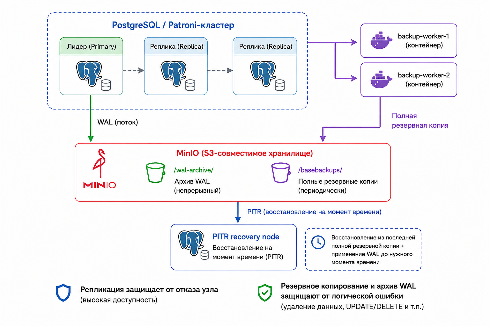

# Резервное копирование и восстановление на выбранный момент времени

## Назначение

Репликация защищает кластер от отказа отдельного PostgreSQL-узла, но не защищает от логических ошибок. Ошибочный `DELETE`, `UPDATE`, `DROP` или неудачная миграция будут воспроизведены на всех репликах. Поэтому для восстановления данных требуется отдельный механизм: полная резервная копия, архив журнала предзаписи PostgreSQL (WAL) и возможность восстановить базу на выбранный момент времени.



В проекте для этого используется pgBackRest. Он выполняет полные резервные копии, архивирует WAL, проверяет состояние репозитория резервных копий и позволяет поднять отдельный восстановительный узел на момент до логической ошибки.

## Хранилище резервных копий

Резервные копии и архив WAL размещаются в объектном хранилище, совместимом с S3. В локальной топологии эту роль выполняет MinIO. Такой выбор отделяет хранилище резервных данных от PostgreSQL-узлов и позволяет проверять восстановление без внешней инфраструктуры.

В промышленной системе вместо локального MinIO должно использоваться внешнее хранилище с собственными гарантиями доступности и долговечности данных. Для него обязательны версионирование, политика хранения, защита от удаления, шифрование и отдельный контроль доступа.

## Организация процесса

Резервное копирование не запускается на каждой реплике. Такой подход создавал бы конкурирующие задания, лишнюю нагрузку и сложность управления. Вместо этого используется отдельный контур из двух рабочих контейнеров:

```text
backup-worker-a
backup-worker-b
  -> взаимное исключение
  -> выбор подходящей реплики
  -> полная резервная копия
  -> проверка репозитория резервных копий
```

Одновременно полную резервную копию выполняет только один рабочий контейнер. Второй контейнер нужен для отказоустойчивости процесса: если один исполнитель недоступен, задание может быть выполнено другим.

Этапы процесса обеспечиваются следующими механизмами:

- Взаимное исключение. В текущей реализации полная резервная копия запускается единичной управляющей командой, поэтому конкурирующие автоматические задания не создаются. При переходе к регулярному расписанию этот этап должен быть закреплен технической блокировкой: например, распределенной блокировкой в согласованном хранилище состояния или блокировкой PostgreSQL, доступной всем рабочим контейнерам. Смысл блокировки состоит в том, что только один исполнитель получает право начать создание полной копии, а остальные завершают попытку или ожидают следующего запуска.
- Выбор подходящей реплики. Исполнитель должен определить текущие роли PostgreSQL-узлов через Patroni и выбрать узел, который находится в режиме реплики, доступен по сети, имеет приемлемую задержку репликации и не участвует в критической синхронной паре так, чтобы резервное копирование не ухудшало запись. Если подходящей реплики нет, резервное копирование не должно автоматически переноситься на основной узел без операционного решения.
- Полная резервная копия. После выбора источника исполнитель запускает pgBackRest с типом полной резервной копии для конфигурационного раздела `rental`. pgBackRest читает данные выбранного PostgreSQL-узла, сохраняет копию в общий репозиторий резервных копий и связывает ее с архивом WAL, необходимым для последующего восстановления на выбранный момент времени.
- Проверка репозитория резервных копий. После создания копии выполняется проверка pgBackRest. Она подтверждает, что репозиторий доступен, конфигурационный раздел корректен, PostgreSQL-узел согласован с репозиторием, а архивирование WAL продолжает работать. Результат проверки сохраняется как эксплуатационный артефакт, потому что успешное завершение команды резервного копирования само по себе не заменяет контроль пригодности репозитория.

## Источник резервной копии

Для резервного копирования предпочтительно использовать реплику, чтобы не создавать дополнительную нагрузку на основной узел. Приоритет источника:

```text
1. асинхронная реплика
2. другая асинхронная реплика
3. синхронная реплика, если это не нарушает требования к записи
4. основной узел только при явном операционном решении
```

Выбор источника должен учитывать задержку репликации, нагрузку на узел и текущий состав синхронных реплик. Основной узел не должен становиться обычным источником резервного копирования, потому что он обслуживает запись.

## Архив журнала предзаписи

Архивирование WAL не зависит от рабочих контейнеров резервного копирования. Его выполняет текущий основной PostgreSQL-узел: после закрытия очередного WAL-сегмента PostgreSQL вызывает команду `archive_command`, а pgBackRest отправляет сегмент в общий репозиторий резервных копий.

Patroni не выбирает реплику для архивирования WAL и не переносит архив вручную. Он применяет к PostgreSQL-узлам единую конфигурацию, в которой включены `archive_mode` и команда `pgbackrest archive-push`. Пока узел является репликой, он получает WAL через потоковую репликацию. После переключения роли новый основной узел начинает сам создавать WAL-сегменты и выполнять тот же `archive_command`.

Параметр `archive_timeout` ограничивает время ожидания до принудительного переключения WAL-сегмента. В проекте он равен 60 секундам, поэтому при наличии активности сегмент не должен слишком долго оставаться незакрытым и незаархивированным. Это не означает периодический выбор реплики: архивирование происходит на основном узле и привязано к закрытию WAL-сегментов.

В проекте архивирование WAL включено как часть базовой конфигурации кластера. При запуске подготавливаются объектное хранилище, параметры доступа к S3-совместимому хранилищу и конфигурационный раздел pgBackRest для выбранного PostgreSQL-кластера. Поэтому отдельный режим включения WAL-архива не требуется: если кластер запущен и проверка pgBackRest проходит, контур резервного копирования должен быть готов к работе.

Ключевые настройки, обеспечивающие этот процесс, заданы в трех местах.

В шаблоне Patroni включается архивирование и указывается команда передачи WAL-сегмента в pgBackRest:

```yaml
archive_mode: "on"
archive_command: "pgbackrest --stanza=${PGBACKREST_STANZA} archive-push %p"
archive_timeout: "60s"
```

В конфигурации pgBackRest задается S3-репозиторий и асинхронная обработка архива:

```ini
repo1-type=s3
repo1-path=/rental-ha
archive-async=y
spool-path=/var/spool/pgbackrest
```

В Docker Compose PostgreSQL-узлы получают параметры доступа к S3-совместимому хранилищу:

```yaml
PGBACKREST_STANZA: rental
PGBACKREST_REPO1_S3_ENDPOINT: ${S3_ENDPOINT:-http://minio}
PGBACKREST_REPO1_STORAGE_PORT: ${S3_PORT:-9000}
PGBACKREST_REPO1_S3_BUCKET: ${S3_BUCKET:-rental-ha-backups}
PGBACKREST_REPO1_S3_REGION: ${S3_REGION:-us-east-1}
PGBACKREST_REPO1_S3_KEY: ${S3_ACCESS_KEY:-minio_admin}
PGBACKREST_REPO1_S3_KEY_SECRET: ${S3_SECRET_KEY:-minio_admin_password}
```

## Восстановление на выбранный момент времени

Восстановление на выбранный момент времени используется для исправления логических ошибок. Оно не заменяет анализ данных и не выполняет автоматический откат рабочего контура. Обычный порядок действий такой:

```text
1. Зафиксировать момент до логической ошибки.
2. Остановить или ограничить новые записи, если это необходимо для расследования.
3. Проверить наличие полной резервной копии и нужных WAL-сегментов в архиве.
4. Восстановить отдельный восстановительный узел до выбранного момента.
5. Сравнить восстановленное состояние с рабочим контуром.
6. Подготовить корректирующие SQL-операции или перенос нужных данных.
7. Проверить результат перед возвратом записи в обычный режим.
```

Если рабочий кластер продолжал принимать корректные записи после логической ошибки, эти данные не нужно терять автоматически. Восстановительный узел дает чистую версию состояния до ошибки, а возврат данных в рабочий контур остается отдельной операционной процедурой.

## Границы

Полная резервная копия и архив WAL дают техническую возможность восстановления, но не гарантируют корректный выбор точки восстановления. Эту точку должен определить оператор или автоматизированная процедура расследования.

Дифференциальные и инкрементальные резервные копии остаются расширением базовой схемы. Они могут уменьшить время создания копий и объем хранилища, но не меняют принцип восстановления: для выбранного момента нужны базовая копия и непрерывный архив WAL до нужной точки.
