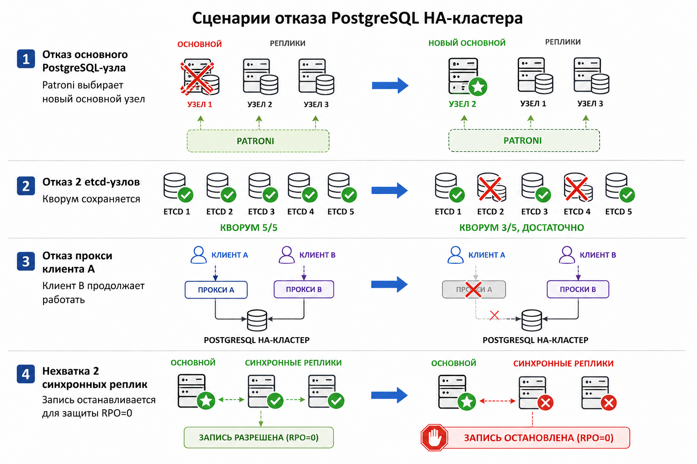

# Операционные инструкции

Операционные инструкции описывают типовые нарушения нормальной работы кластера и порядок восстановления контролируемого состояния. Документ не задает демонстрационный сценарий; он фиксирует, какие признаки считаются существенными, какие действия выполняются в первую очередь и чем подтверждается восстановление.

## Общий порядок реагирования

При любом инциденте сначала фиксируется текущее состояние системы: роли PostgreSQL-узлов в Patroni, доступность кворума etcd, маршруты HAProxy, состояние PgBouncer, наличие синхронных реплик, последние ошибки архивации WAL и состояние резервного репозитория. После этого принимается решение: ждать автоматического восстановления, вручную ограничить запись, восстановить отказавший компонент или изолировать логически поврежденные данные.

Контрольное завершение инцидента включает четыре проверки:

- кластер имеет ровно один основной PostgreSQL-узел;
- маршрут записи ведет на текущий основной узел;
- политика синхронного подтверждения записи соответствует требованию `RPO = 0`;
- резервный контур остается пригодным: архив WAL продолжается, а pgBackRest-репозиторий доступен.

## Отказ основного PostgreSQL-узла

Признаки: текущий основной узел перестает отвечать, Patroni снимает с него лидерство, HAProxy временно перестает направлять запись или переключает маршрут на новый основной узел.

Порядок действий:

1. Определить текущие роли узлов через Patroni REST API, PMM или SQL-проверку `pg_is_in_recovery()`.
2. Проверить, что большинство etcd-узлов доступно и кластер согласования способен принять решение о новом лидере.
3. Дождаться автоматического переключения Patroni.
4. Убедиться, что HAProxy направляет маршрут записи на новый основной узел.
5. Выполнить контрольную запись и контрольное чтение.
6. Вернуть отказавший узел в состав кластера как реплику и проверить, что он догнал текущий основной узел.

Ожидаемый результат: в кластере остается один основной узел, подтвержденные до отказа транзакции доступны после переключения, новые записи принимаются только при наличии требуемых синхронных подтверждений.

## Потеря синхронных реплик

Признаки: количество синхронных standby-узлов становится меньше заданного уровня, записи начинают ожидать подтверждения или останавливаются.

Порядок действий:

1. Проверить `pg_stat_replication` на текущем основном узле и определить, какие реплики имеют состояние `sync`.
2. Проверить состояние Patroni и убедиться, что список синхронных кандидатов не содержит недоступных узлов.
3. Если доступна другая догнавшая реплика, дождаться ее включения в синхронный набор.
4. Если двух подходящих синхронных реплик нет, не ослаблять гарантию записи без отдельного эксплуатационного решения.
5. Восстановить отказавшие реплики или добавить новый узел, затем проверить возврат к требуемому числу синхронных подтверждений.

Ожидаемый результат: запись либо продолжается с требуемой гарантией, либо останавливается защитно. Система не подтверждает новые изменения с более слабой сохранностью данных.

## Потеря кворума etcd

Признаки: Patroni не может надежно читать или обновлять распределенное состояние, выбор нового основного узла становится невозможным, часть узлов может видеть разные фрагменты кластера.

Порядок действий:

1. Проверить доступность всех etcd-узлов и определить, осталось ли большинство.
2. При наличии большинства восстановить недоступные узлы без ручного назначения PostgreSQL-лидера.
3. При потере большинства остановить операции, которые могут привести к конкурирующим решениям о лидерстве.
4. Восстановить etcd до состава с большинством узлов.
5. После восстановления кворума проверить, что Patroni снова видит единое состояние и только один PostgreSQL-узел имеет роль основного.

Ожидаемый результат: решения о лидерстве принимаются только через кворум. Ручные действия не создают ситуацию, в которой два узла одновременно считают себя основными.

## Отказ клиентской цепочки PgBouncer + HAProxy

Признаки: один клиентский путь перестает принимать соединения, но PostgreSQL-кластер и альтернативная клиентская цепочка остаются работоспособными.

Порядок действий:

1. Определить, какой компонент отказал: PgBouncer, HAProxy, сетевой маршрут или целевой PostgreSQL-узел.
2. Проверить доступность альтернативной клиентской цепочки.
3. При необходимости временно переключить клиента на исправный путь подключения.
4. Восстановить отказавший PgBouncer или HAProxy.
5. Проверить, что после восстановления пул соединений не содержит зависших сессий и маршрут записи снова ведет на текущий основной узел.

Ожидаемый результат: отказ одной клиентской цепочки не становится общей точкой отказа для всех клиентов.

## Логическая ошибка в данных

Признаки: обнаружено ошибочное изменение данных: некорректный `DELETE`, `UPDATE`, `DROP`, неудачная миграция или массовое изменение, противоречащее бизнес-инвариантам.

Порядок действий:

1. Зафиксировать время обнаружения и предполагаемый момент ошибки.
2. При необходимости вручную остановить прикладную запись, чтобы не смешивать корректные и поврежденные изменения.
3. Проверить, что ошибка действительно реплицировалась на рабочий кластер.
4. Выбрать точку восстановления до ошибки.
5. Поднять отдельный восстановительный узел из полной резервной копии и архива WAL.
6. Сравнить данные восстановительного узла с рабочим кластером и определить корректный способ возврата данных: точечная выгрузка, обратная миграция или полная замена поврежденной области.
7. После возврата данных выполнить повторные проверки бизнес-инвариантов.

Ожидаемый результат: восстановление выполняется через отдельный узел, а не через откат всего рабочего кластера без анализа. Это снижает риск потери корректных изменений, сделанных после логической ошибки.

## Деградация резервного контура

Признаки: полная резервная копия не создается, `pgbackrest info` или `pgbackrest check` завершаются ошибкой, архивирование WAL останавливается, S3-совместимое хранилище недоступно.

Порядок действий:

1. Проверить доступность S3-совместимого хранилища и учетных данных pgBackRest.
2. Проверить состояние `archive_mode`, `archive_command` и счетчики `pg_stat_archiver` на текущем основном узле.
3. Проверить рабочие контейнеры резервного копирования и определить, какой исполнитель может выполнить задание.
4. Запустить проверку репозитория pgBackRest.
5. После устранения причины выполнить полную резервную копию и повторную проверку репозитория.

Ожидаемый результат: архив WAL продолжается с текущего основного узла, репозиторий резервных копий доступен, а последняя полная резервная копия пригодна для восстановления.

## Деградация наблюдаемости

Признаки: PMM, custom exporter или отдельные endpoints метрик недоступны, главный дашборд не показывает состояние компонентов или показывает устаревшие данные.

Порядок действий:

1. Проверить доступность PMM Server и регистрацию сервисов в inventory.
2. Проверить endpoints PostgreSQL, Patroni, HAProxy, etcd, PgBouncer, MinIO, pgBackRest и backup-worker.
3. Проверить custom exporter, который формирует агрегированную таблицу состояния компонентов.
4. После восстановления exporter-ов убедиться, что главный дашборд снова показывает актуальные роли узлов, состояние синхронных реплик, кворум etcd, резервный контур и клиентские цепочки.

Ожидаемый результат: отказ мониторинга не влияет на работу PostgreSQL-кластера, но устраняется как отдельный эксплуатационный риск, потому что без наблюдаемости сложнее безопасно управлять отказами.
