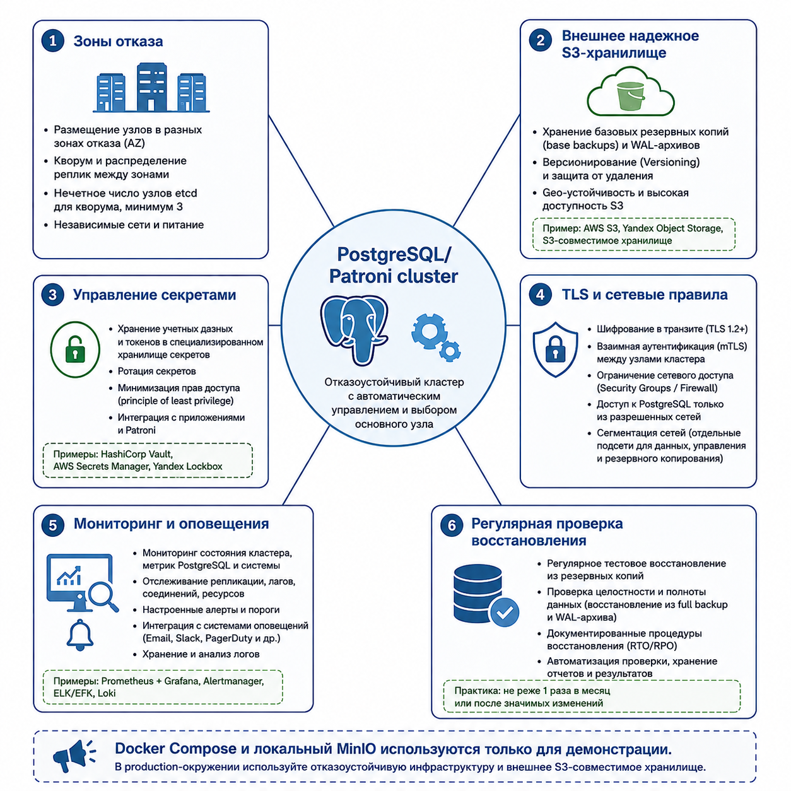

# Требования к промышленной эксплуатации

Локальная контейнерная топология предназначена для воспроизведения архитектурных решений и проверки отказных сценариев. Для промышленной эксплуатации необходимы дополнительные требования к размещению, сети, хранилищу резервных копий, секретам, наблюдаемости и операционным процедурам.

## Размещение

- Узлы должны быть разнесены по независимым зонам отказа.
- etcd должен использовать независимые диски, сетевые каналы и вычислительные ресурсы.
- PostgreSQL-узлы не должны размещаться на одном физическом хосте или в одной отказной зоне.
- Клиентские прокси, узлы мониторинга и рабочие контейнеры резервного копирования должны размещаться так, чтобы отказ одного узла инфраструктуры не выводил из строя весь контур.

## Сеть

- Соединения между клиентами, прокси и PostgreSQL должны быть защищены TLS.
- Доступ к Patroni REST API должен быть ограничен доверенными административными сетями.
- Для etcd, PostgreSQL, прокси, резервного копирования и мониторинга должны использоваться отдельные сетевые правила доступа.
- Межузловые соединения Patroni, etcd и PostgreSQL должны быть наблюдаемыми и защищенными от несанкционированного доступа.

## Хранилище резервных копий

- Резервные копии и архив WAL должны размещаться во внешнем объектном хранилище, совместимом с S3. Локальный MinIO не является промышленным хранилищем.
- Хранилище должно поддерживать версионирование объектов.
- Для защиты от ошибочного или злонамеренного удаления должна применяться блокировка объектов или эквивалентный режим неизменяемого хранения.
- Данные должны быть зашифрованы при хранении.
- Должна быть задана политика хранения резервных копий и WAL-сегментов.
- Должен контролироваться разрыв между созданием WAL и его попаданием в архив.

## Секреты

- Пароли, ключи доступа к S3-совместимому хранилищу и ключи шифрования не должны храниться в Git.
- Секреты должны выдаваться через менеджер секретов или защищенный контур доставки конфигурации.
- Доступ рабочих контейнеров резервного копирования к объектному хранилищу должен быть ограничен необходимой областью хранения и префиксом объектов.
- Ротация секретов должна выполняться по регламенту и проверяться на восстановительном контуре.

## RPO/RTO

`RPO` (`Recovery Point Objective`, целевая точка восстановления) в этом проекте понимается как допустимая потеря данных при аварии.

`RTO` (`Recovery Time Objective`, целевое время восстановления) определяет допустимое время восстановления работы после аварии.

В промышленной эксплуатации должны быть явно зафиксированы:

- RPO для отказа основного PostgreSQL-узла;
- RPO для восстановления из резервной копии и архива WAL;
- RTO автоматического переключения на новый основной узел;
- RTO восстановления из резервной копии;
- RTO восстановления на выбранный момент времени.

## Наблюдаемость

- Оповещение о потере основного PostgreSQL-узла.
- Оповещение о потере синхронных реплик.
- Оповещение о риске потери кворума etcd.
- Оповещение об ошибке архивирования WAL.
- Оповещение об отсутствии свежей резервной копии.
- Регулярная проверка восстановления из резервной копии и архива WAL.
- Контроль задержки репликации, состояния клиентских прокси и доступности репозитория резервных копий.

## Операционные процедуры

- Процедура переключения при отказе основного узла.
- Процедура действий при потере кворума etcd.
- Процедура восстановления из резервной копии.
- Процедура восстановления на выбранный момент времени.
- Процедура ротации секретов.
- Процедура обновления PostgreSQL, Patroni и etcd.
- Процедура проверки резервных копий и восстановления на изолированном контуре.
