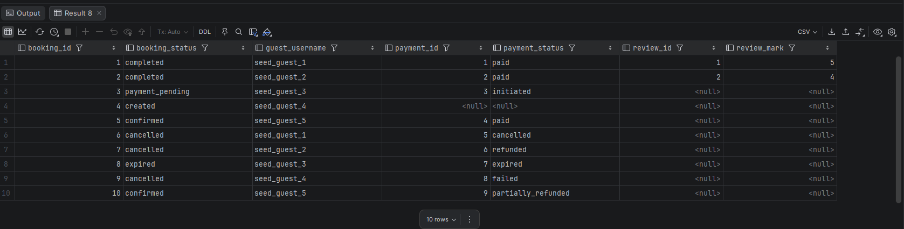

# Отчет по бронированиям, платежам и отзывам

## Что выполнялось

Сценарий строит отчет по бронированиям: кто создал бронь, есть ли платеж и есть ли отзыв. Обязательная связь бронирования с гостем выражена через `INNER JOIN`, а платеж и отзыв подключаются через `LEFT JOIN`.

SQL-запрос: `request.sql`.

## Полученный результат

Артефакт выполнения находится в `artifacts/result.png`. В результате сохраняются бронирования без платежа или отзыва, потому что исходной таблицей является `bookings`, а платеж и отзыв являются необязательными продолжениями сценария.

## Что доказывает сценарий

Модель корректно разделяет обязательные и необязательные связи. Бронирование всегда связано с пользователем-гостем, но платежная сессия и отзыв могут отсутствовать в зависимости от стадии жизненного цикла бронирования.
