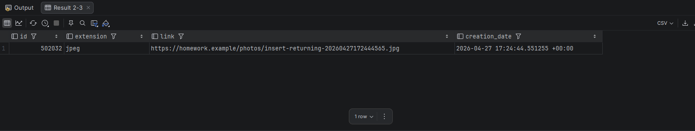

# Создание фотографии с возвратом результата

## Что выполнялось

Сценарий добавляет запись в `application.photos` и сразу возвращает созданные поля через `INSERT ... RETURNING`.

Такой прием нужен прикладному слою при публикации фотографий объявления: после вставки приложение получает идентификатор, ссылку, расширение и дату создания без отдельного чтения из базы.

SQL-запрос: `request.sql`.

## Полученный результат

Артефакт выполнения находится в `artifacts/result.png`. На снимке видно, что PostgreSQL вернул строку с новым `id`, расширением, ссылкой и временем создания.

## Что доказывает сценарий

Схема допускает создание независимого объекта фотографии до его привязки к объявлению. Возврат результата из одной команды делает операцию атомарной для прикладного слоя: приложение не выполняет дополнительный поиск созданной строки.
